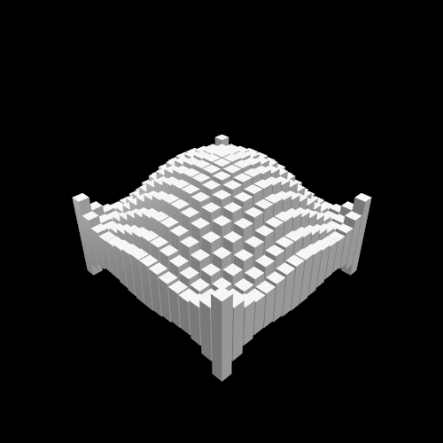

# Cube Wave

Animation of a wave propagating over "cubes"

Inspiered by [this GIF](https://beesandbombs.tumblr.com/post/149654056864/cube-wave)

## Video

Animation (click on image):

You can also see it in action by running the `main.py`  
To just play / watch the animation, download the [simple version](https://github.com/0dminnimda/Cube_Wave/releases/tag/2021.07.19)  
Try changing some parameters, it's pretty interesting to see the result!  
But if you want consistent video output, download this version with Renderer  

## Snapshots

